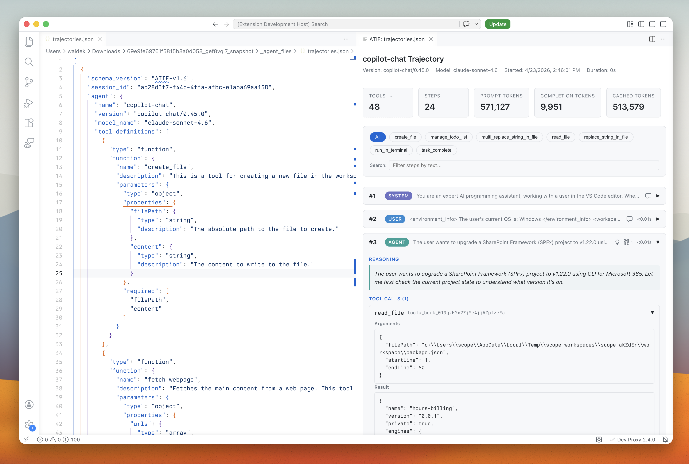

# ATIF Preview

**See what your AI agent actually did.** Open any [ATIF](https://www.harborframework.com/docs/agents/trajectory-format) trajectory file and get an interactive, step-by-step view of every message, tool call, reasoning trace, and token cost — right inside VS Code.

## Why

Raw trajectory JSON is painful to read. Scrolling through hundreds of lines to find a failed tool call or understand an agent's reasoning chain kills your flow. This extension turns that JSON into a navigable timeline so you can diagnose agent behavior in seconds instead of minutes.

## Features

- **One-click preview** — click the preview icon in the editor title bar on any JSON file
- **Step-by-step timeline** — every user message, agent response, and system event as a collapsible card
- **Tool call inspection** — expand any tool call to see arguments, results, and matched observations
- **Reasoning traces** — agent thinking/chain-of-thought displayed inline with visual distinction
- **Token & cost metrics** — per-step and aggregate prompt tokens, completion tokens, cached tokens, and USD cost
- **Multi-trajectory support** — files with multiple trajectories render as tabs (parent + subagent)
- **Subagent navigation** — click through to linked subagent trajectories, including external file references
- **Filter & search** — filter steps by tool name or search across all message content
- **Skill usage detection** — spot when an agent reads files from a known Agent Skills location (`.github/skills/`, `.claude/skills/`, `.agents/skills/`, `.copilot/skills/`), with per-skill filter pills and step indicators
- **Live reload** — preview updates automatically as you edit the source file
- **Native VS Code look** — uses your theme colors, codicons, and standard UI patterns

## Getting Started

1. Install the extension
2. Open an ATIF trajectory JSON file
3. Click the **preview icon** in the editor title bar (or run `ATIF: Preview Trajectory` from the Command Palette)

The preview opens in a side panel so you can read the trajectory alongside the raw JSON.

## What is ATIF?

[Agent Trajectory Interchange Format (ATIF)](https://www.harborframework.com/docs/agents/trajectory-format) is an open schema for recording what AI agents do — the messages, tool calls, observations, metrics, and reasoning that make up a session. It gives you a standard way to capture, share, and analyze agent runs across different frameworks and models.
